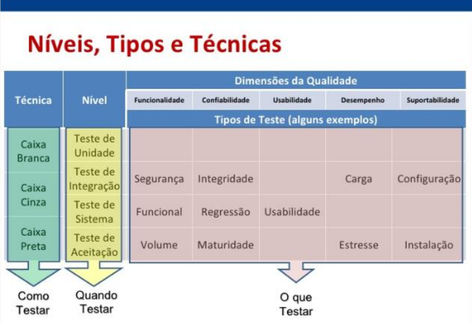
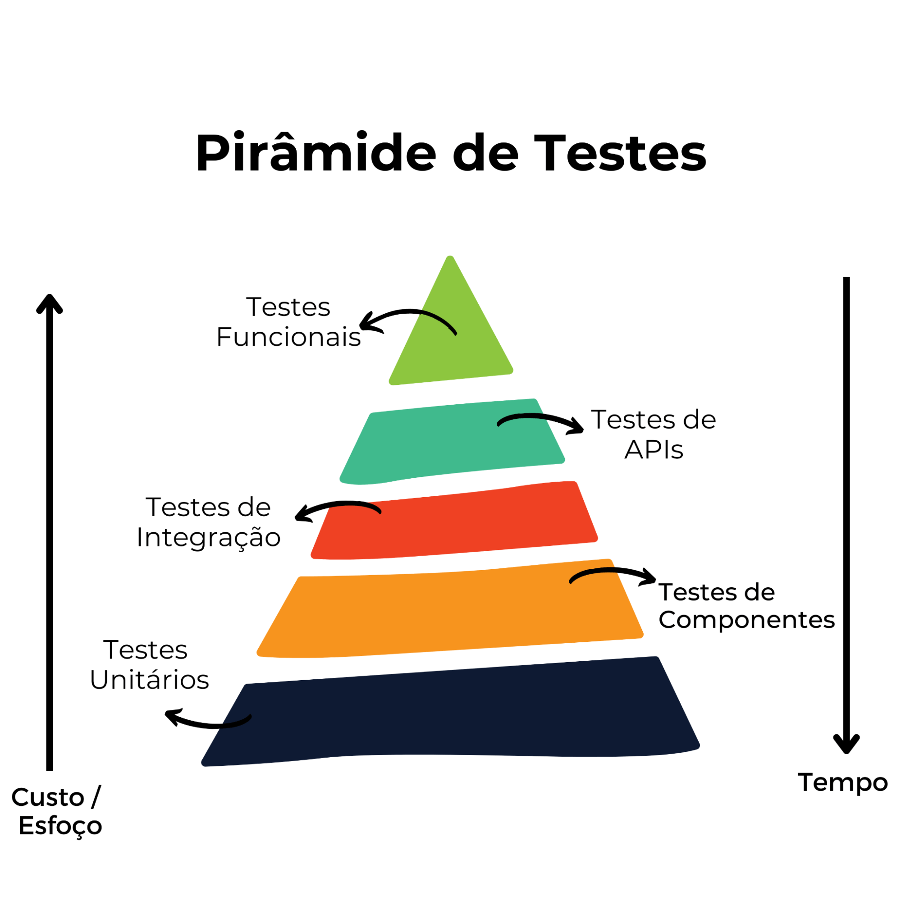
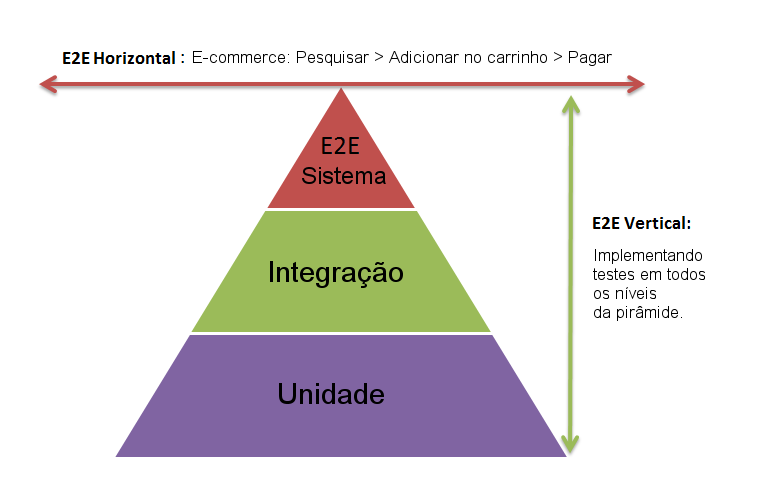

# RestAssured

# Quais são os principais tipos de teste de software?
A depender do contexto e da preferência do profissional ou da empresa, há diversos tipos de testes de software para serem executados:

- Teste da caixa branca – avalia a estrutura interna do código-fonte, por meio de testes dos caminhos de execução específicos, que garantem que todas as instruções sejam executadas corretamente. 
-  Teste da caixa preta – examina o software apenas com base em sua interface externa, sem considerar a sua estrutura interna. Os testes são fundamentados nos requisitos e nas funcionalidades esperadas pelo usuário.
-  Teste da caixa cinza – combina elementos do teste da caixa branca e da caixa preta, em que parte do conhecimento interno do sistema é utilizado, mas também se concentra na funcionalidade externa.
-  Teste de regressão – verifica se as alterações recentes no código afetaram negativamente o funcionamento das funcionalidades existentes. Geralmente, é automatizado para garantir que as correções ou novos recursos não insiram bugs no software existente.
-  Teste de unidade – estuda unidades individuais de código isoladamente para garantir que cada parte do software funcione conforme o esperado.
- Teste de integração – avalia a interação entre diferentes partes do sistema para garantir que elas funcionem em conjunto, de maneira integrada e sem problemas.
- Teste de carga – verifica o desempenho do software sob condições de carga máxima (ou o mais próximo disso), observando como ele se comporta quando submetido a um grande volume de dados ou usuários simultâneos.
- Teste de usabilidade – avalia a facilidade de uso e a experiência do usuário do software, garantindo que seja intuitiva e eficiente para os usuários finais.
- Teste de estresse –tests the limits of software by subjecting it to extreme conditions or conditions beyond normal specifications to assess its stability and resilience. testa os limites do software, submetendo-o a condições extremas ou além das especificações normais, para avaliar sua estabilidade e capacidade de recuperação.
# Testes de software: tipos, níveis e técnicas

 Para cada momento do ciclo de vida de um determinado produto de software, deve-se utilizar diferentes abordagens, o que inclui técnicas, ferramentas e pessoas

## Pirâmida de Testes 
A pirâmide de testes é uma ilustração que permite visualizar de forma simples os tipos de testes, seus níveis, velocidades, complexidades e “custos”.

# Testes de API 
  
  ### Tipos de Testes 
  - Funcional
  - Aceitação
  - Sanidade
  - Contrato
  - Saúde dos endpoints

  -  escolha dos testes automatizados candidatos, ou seja, os mais críticos, deve ser realizada com base no contexto do projeto de automação. No entanto, apesar de não existir uma categorização amplamente difundida, a experiência tem mostrado que os testes candidatos são normalmente agrupados em quatro áreas distintas:

Smoke Tests: Um conjunto mínimo de testes é selecionado com o objetivo de validar um Build ou liberação antes do início de um ciclo de testes;
Testes de Regressão: Os testes são selecionados com o objetivo de executar o re-teste de uma funcionalidade ou da aplicação inteira;
Funcionalidades Críticas: Os testes são selecionados com o objetivo de validar as funcionalidades críticas que podem trazer riscos ao negócio;
Tarefas Repetitivas: Os testes são selecionados com o objetivo de reduzir o envolvimento dos testadores em atividades manuais repetitivas e suscetíveis a erros, tais como cálculos matemáticos, simulações, processamentos, comparações de arquivos ou dados, etc.

#BDD

Behavior Driven Development (Desenvolvimento Orientado a Comportamento)
É uma abordagem de desenvolvimento e testes que:

✅ Foca no comportamento esperado do sistema, do ponto de vista do usuário (não da implementação técnica)
✅ Usa uma linguagem comum entre desenvolvedores, testers e área de negócio
✅ Permite que os testes sejam escritos como exemplos de uso real
✅ Promove colaboração e clareza nos requisitos

Vantagens:

-Testes de aceitação
-especificação executáveis 

## CUCUMBER

##Cenários 

- O cenário é um exemplo concreto de uma regra de negócios
- Um cenário usa exemplos concretos para explicar ideias abstratas

  ### Formatos:

    -Dado(pre-condição)
    -Quando(ação)
  -Então(resultado esperado)

### 

### Gherkin 
  

-Linguagem Natural com algumas funcionalidades 
-Pessoas técnicas e não técnicas podem entender ou descrever cenários 
-Permite que os testes sejam executados, se tornando assim uma documentação viva
  #### Palavras chaves
   -
-Funcionalidades: 
Referências:
https://medium.com/opanehtech/gherkin-e-cucumber-mapeando-os-testes-automatizados-53232bf26e79
https://cucumber.io/docs/cucumber/api/?lang=java#tags
https://blog.onedaytesting.com.br/piramide-de-teses/
